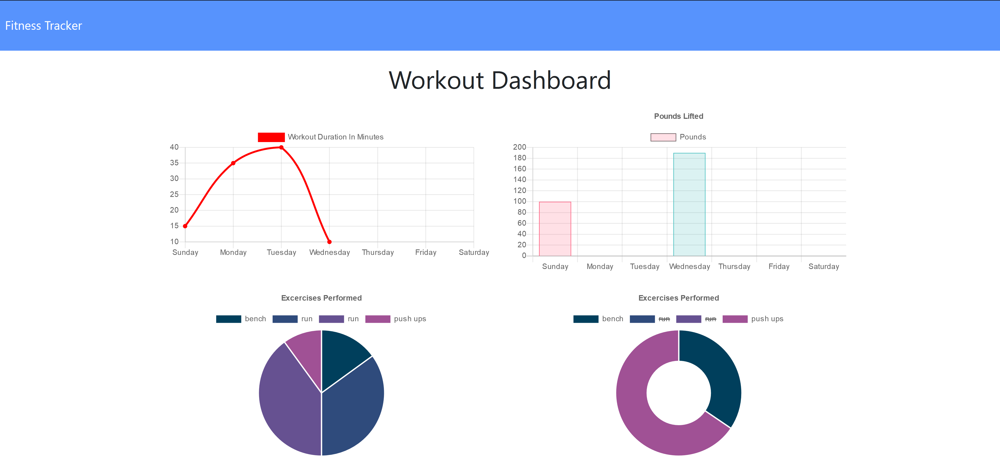

# Fitness Tracker

# Table of Contents
-[Description](#description)
-[Installation](#installation)
-[Usage](#usage)
-[Licenses](#licenses)
-[Contribution](#contribution)
-[Test](#test)
-[Username](#username)
-[Questions](#questions)

## Description:
 A fitness tracker that stores users workouts then displays the data of their workout on a stats dashboard.
    

## Installation: 
Dependencies: body-parser, connect-mongo, dotenv, express, express-session, mongoose, morgan

## Usage: 
node app.js

   
## Licenses: 
MIT

## Contribution: 
NU Full Stack Bootcamp

    
## Test:
No test specified

## Questions

Contact me:
### Username 
Github: oroth8

### Email 
rothowen27@gmail.com

[gitHub_URL](https://github.com/oroth8)
[gitHub_Repo_URL](https://github.com/oroth8/fitnesstracker)

